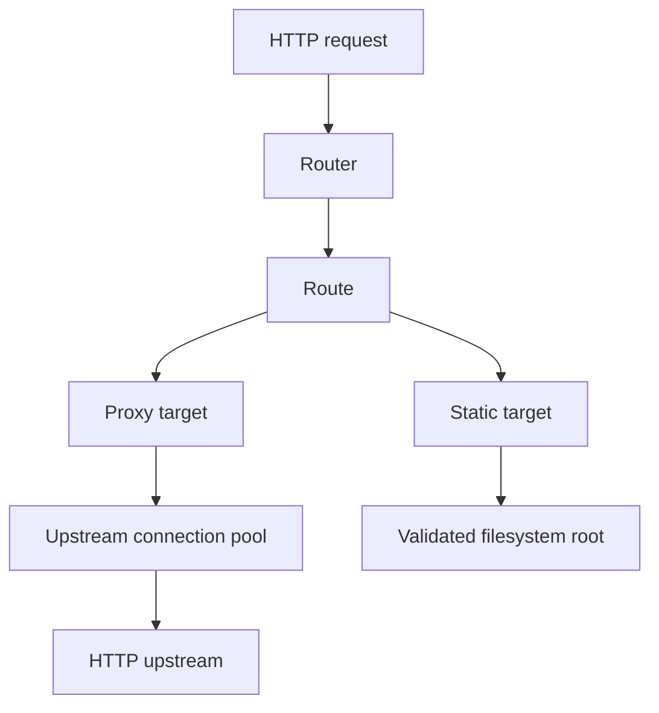

# Architecture

Via is a concurrent streaming I/O proxy.

Each accepted client connection runs in an independent Crystal fiber. Socket
waits yield to the Crystal runtime scheduler, and Via does not put requests
behind a global lock. Independent client connections can therefore make
progress concurrently.

## Code boundaries

The implementation is split into bounded modules:

```text
Via::Configuration  YAML model, validation, loading, watching, reload
Via::Routing        immutable route targets and route selection
Via::HTTP           request IDs, error pages, forwarding header policy
Via::Proxy          upstream transport and connection pooling
Via::Runtime        atomic generations and diagnostic state
Via::Static         filesystem containment and file serving
Via::TLS            contexts and reloadable TLS listeners
```

The source tree mirrors these namespaces under `src/via/`. `Via::CLI`,
`Via::Server`, and `Via::ServerGroup` remain at the root because they compose
modules into listener and process lifecycles.

This keeps configuration, routing, transport, and lifecycle decisions
independent and directly testable.

## Request flow



The router is independent of the HTTP server and client transports. It only
selects a validated route from a hostname and path.

Each active upstream request owns its `HTTP::Client`; clients are never shared
concurrently between fibers. Successfully completed clients return to a
bounded idle pool and can reuse their keep-alive connections.

## Configuration generations

A validated listener configuration creates an immutable proxy generation
containing its router and upstream connection pools. Each listener has its own
runtime state. Hot reload validates every listener configuration first, then
swaps each listener's generation.

The previous generation is retired rather than closed immediately. It tracks
active requests and closes its idle upstream clients once its last request
finishes. This keeps reload atomic without interrupting in-flight streams.

For TLS listeners, each accepted TCP connection snapshots the current
`OpenSSL::SSL::Context::Server` before its handshake. Configuration reload
creates and validates a replacement context before publishing it with the new
proxy generation. Existing TLS connections continue normally; new connections
receive the replacement certificate.

Static routes use the same immutable routing generation as proxy routes.
Validated static roots are canonical paths. Each request is decoded and
resolved again so traversal attempts and symlinks escaping the root cannot
bypass configuration-time validation.

## Streaming and backpressure

Via passes the incoming request body directly to the upstream HTTP client. It
copies the upstream response through a fixed-size buffer instead of loading the
entire body into memory.

When either side becomes slower, socket writes suspend the current fiber and
backpressure propagates through the stream. Body size therefore does not
determine Via's buffering requirement.

Hop-by-hop headers are removed at each proxy boundary. End-to-end request and
response headers, methods, paths, queries, and response statuses are forwarded.
